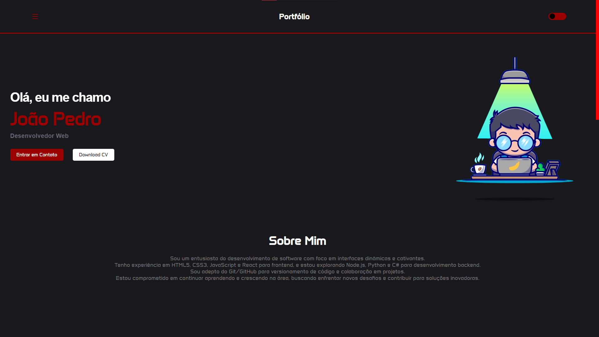

# Portfolio



Este é o meu portfólio pessoal, desenvolvido utilizando React.

## Descrição

Este projeto foi criado com o objetivo de exibir meu trabalho, habilidades e experiência para potenciais empregadores, colegas de trabalho e qualquer pessoa interessada em aprender mais sobre mim.

## Funcionalidades

- Exibição de informações de contato para que as pessoas possam entrar em contato facilmente.
- Seção de projetos, onde posso destacar alguns dos meus trabalhos mais relevantes.
- Seção de habilidades, listando as tecnologias que domino.

## Tecnologias Utilizadas

- React
- HTML/CSS
- JavaScript

## Como Executar

1. Certifique-se de ter o Node.js instalado em sua máquina.
2. Clone este repositório para o seu ambiente local.
3. No terminal, navegue até o diretório do projeto (no seu caso, "Portfolio").
4. Execute o seguinte comando para instalar as dependências:

   ```
   npm install
   ```

5. Após a conclusão da instalação, inicie o servidor de desenvolvimento com o comando:

   ```
   npm run dev
   ```

6. Abra o seu navegador e visite o link fornecido no terminal para visualizar o portfólio e ver as alterações em tempo real.

## Visualização Online

Este projeto também está disponível online, você pode acessá-lo em [https://portfolio-ivory-three-40.vercel.app/](https://portfolio-ivory-three-40.vercel.app/).

## Contribuições

Contribuições são sempre bem-vindas! Se você encontrar algum problema ou tiver sugestões de melhorias,  sinta-se à vontade para entrar em contato através do e-mail [joaopedroap50@gmail.com].


## Autor

João Pedro Pimentel
